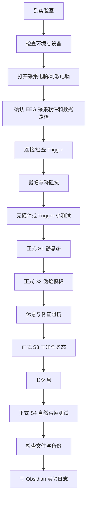

# P4 EEG 真实设备连接与正式采集指南

> [!important]
> 这份指南模拟你从“到实验室”到“完成一个被试 S1-S4 采集”的完整操作。由于当前还不知道实验室具体 EEG 设备型号、采集软件、Trigger 硬件和数据格式，所有设备相关参数都必须在现场向学长/老师确认后填写，不能凭猜测操作。

相关文档：[[proposal|P4 proposal]]、[[P4_实验操作指南|P4 实验操作指南]]、[[experiment/README|实验代码说明]]、[[CLAUDE|CLAUDE.md 项目规则]]。

---

## 0. 你必须先知道的硬件信息

第一次去实验室时，先拿这张表问学长或负责设备的人。

| 项目 | 现场填写 | 为什么重要 |
| --- | --- | --- |
| EEG 设备品牌/型号 |  | 决定驱动、采集软件和数据格式 |
| 采集软件名称 |  | 决定怎么开始 recording、怎么看 marker |
| EEG 通道数 |  | 决定帽子、阻抗、后处理 montage |
| 电极系统 |  | 10-20 / 10-10 / 自定义 |
| 数据格式 |  | MNE 后续读取方式不同 |
| Trigger 连接方式 |  | 串口 COM / 并口 LPT / USB / LSL |
| Trigger 端口号 |  | 代码里的 `--port COMx` |
| 波特率 | 115200 | 串口设备必须一致 |
| 采集电脑和刺激电脑 | 同一台 / 两台 | 决定线缆和同步方式 |
| 刺激屏幕刷新率 | 60Hz / 其他 | SSVEP 依赖 60Hz |
| 数据保存位置 |  | 防止找不到原始数据 |
| 数据备份位置 |  | 实验结束后必须备份 |

> [!danger]
> 如果不知道 Trigger 连接方式和端口号，不要做正式采集。可以先无硬件测试，但不能把无 Trigger 的数据当正式数据。

---

## 1. 到实验室后的总流程



---

## 2. 到实验室：环境准备

### 2.1 房间环境

- [ ] 手机开飞行模式或远离设备
- [ ] 关闭不必要的电源设备
- [ ] 避免被试靠近大型电器、电源插座、强磁/强电设备
- [ ] 椅子高度合适，被试脚能平放
- [ ] 桌面清空，避免被试碰线
- [ ] 刺激屏幕正对被试
- [ ] 主试能同时看到采集软件波形和刺激程序状态

### 2.2 角色分工

建议至少两个人：

| 角色 | 负责 |
| --- | --- |
| 主试 | 跑 PsychoPy、给指导语、记录异常 |
| EEG 采集员 | 戴帽、降阻抗、看波形、保存数据 |
| 被试 | 按指导语完成任务 |

如果只有你一个人，要优先保证：

1. 采集软件正在 recording。
2. Marker 能进采集软件。
3. 被试理解什么时候不能眨眼。

---

## 3. 打开电脑和软件

### 3.1 打开电脑

如果采集电脑和刺激电脑是同一台：

1. 开机。
2. 登录 Windows。
3. 打开 EEG 采集软件。
4. 打开 Anaconda Prompt。
5. 打开 Obsidian 或实验日志。

如果采集电脑和刺激电脑是两台：

1. 先开 EEG 采集电脑。
2. 再开刺激电脑。
3. 确认两台电脑之间的 Trigger 线连接正常。
4. 确认刺激电脑能控制 Trigger 设备。

### 3.2 打开 Obsidian

打开 vault：

```text
D:\EEG_Project
```

打开这些笔记：

- [[P4_真实设备连接与正式采集指南|本指南]]
- [[P4_实验操作指南|P4 实验操作指南]]
- [[proposal|P4 proposal]]

### 3.3 打开终端

推荐使用 **Anaconda Prompt**。

```bat
D:
cd D:\EEG_Project\P4_EEG降噪与任务特征保真\experiment
conda activate eeg-p4
python --version
```

必须看到：

```text
Python 3.10.20
```

> [!warning]
> 如果不是 Python 3.10，不要继续跑实验。重新执行 `conda activate eeg-p4`。

---

## 4. EEG 设备连接与采集软件设置

> [!warning]
> 这一节必须根据实验室实际设备调整。下面写的是通用流程，不代表具体品牌软件的按钮名称完全一样。

### 4.1 连接硬件

通用顺序：

1. 确认 EEG 放大器电源关闭或处于安全状态。
2. 连接 EEG 放大器到采集电脑。
3. 连接电极帽/电极线到放大器。
4. 如果有参考电极、地电极，按实验室 SOP 连接。
5. 连接 Trigger 线：刺激电脑/Trigger 盒 → EEG 采集设备。
6. 打开放大器电源。
7. 打开采集软件。
8. 确认软件能识别设备。

### 4.2 采集软件设置

在采集软件中确认：

- [ ] 被试编号：`Sub_001` 这类匿名编号
- [ ] 采样率：现场确认，例如 500Hz / 1000Hz
- [ ] 通道数正确
- [ ] 电极 montage 正确
- [ ] 数据保存路径正确
- [ ] Marker/Trigger 显示通道已开启
- [ ] 滤波设置符合实验室要求
- [ ] recording 前能看到实时 EEG 波形

> [!danger]
> 不要用真实姓名做文件名。不要把被试隐私写进实验文件名。

### 4.3 数据路径建议

采集软件原始数据建议保存到实验室指定位置，例如：

```text
D:\EEG_Raw\P4\Sub_001\
```

PsychoPy 事件 `.npz` 默认保存到：

```text
D:\EEG_Project\P4_EEG降噪与任务特征保真\experiment\data\
```

> [!warning]
> `experiment/data/` 不进 git。真实 EEG 原始数据也不进 git。

---

## 5. 确认 Trigger / Marker

### 5.1 找到真实 COM 口

在 Windows：

```text
设备管理器 → 端口 COM 和 LPT
```

常见情况：

| 看到的端口 | 运行命令参数 |
| --- | --- |
| COM3 | `--port COM3` |
| COM4 | `--port COM4` |
| COM5 | `--port COM5` |

代码默认：

```text
COM3
baud_rate = 115200
```

Python 发送协议已对齐可正常打标的 MATLAB 脚本：每个 Marker 发送 4 字节帧 `marker, 0x55, 0x66, 0x0D`，随后发送 `0, 0x55, 0x66, 0x0D` 归零。

如果现场是 COM4，就必须运行：

```bat
python launcher.py --subject Sub_001 --session 1 --port COM4
```

### 5.2 Trigger 测试

目前项目还没有独立 `trigger_test.py`。正式采集前建议补一个 Trigger 测试脚本。临时测试可以这样做：

1. 采集软件开始预览或 recording。
2. 运行一个很短的 Session 1 测试。
3. 看采集软件是否收到 Marker 11 / 12。

测试命令：

```bat
python launcher.py --subject TriggerTest --session 1 --windowed --port COM3
```

如果没有真实硬件，只能用：

```bat
python launcher.py --subject TriggerTest --session 1 --windowed --no-hardware
```

但无硬件模式不会发送真实 Trigger。

> [!danger]
> 正式数据必须确认 Marker 进入 EEG 采集软件。只看到 PsychoPy 程序运行，不代表 EEG 数据里有 Marker。

### 5.3 应该看到哪些 Marker

> 权威源 = `experiment/config.py:MARKER_TABLE`。本表与之保持一致。

| Session | Marker |
| --- | --- |
| S1 睁眼开始/结束 | 11 / 12 |
| S1 闭眼开始/结束 | 21 / 22 |
| S2 按键与伪迹起始 | 30 / 31 |
| S2 伪迹类型 (眨眼/连眨/扫视/咬牙/吞咽) | 41 / 42 / 43 / 44 / 45 |
| S2 伪迹类型 (左/右摇头, 上下点头) | 46 / 47 / 48 |
| S3 Oddball (标准/靶) | 61 / 62 |
| S3 任务间重基线 | 63 |
| S3 SSVEP (6 / 8.57 / 10 / 15 Hz) | 71 / 72 / 73 / 74 |
| S4 Oddball (标准/靶) | 81 / 82 |
| S4 SSVEP (6 / 8.57 / 10 / 15 Hz) | 91 / 92 / 93 / 94 |

---

## 6. 戴帽与阻抗

### 6.1 被试准备

让被试：

- [ ] 去洗手间
- [ ] 摘掉金属饰品
- [ ] 手机远离或飞行模式
- [ ] 坐姿稳定
- [ ] 双脚平放
- [ ] 手放扶手或大腿
- [ ] 下巴微收，避免颈部肌肉紧张

### 6.2 戴帽

按实验室设备 SOP 操作：

1. 选择合适尺寸电极帽。
2. 对齐 Cz / nasion / inion / 左右耳前点。
3. 固定帽子。
4. 加导电膏或盐水。
5. 连接参考和地。
6. 打开阻抗检查。

### 6.3 阻抗标准

目标：

```text
所有通道 < 10 kΩ
最好 < 5 kΩ
```

重点通道：

| 通道区域 | 原因 |
| --- | --- |
| Fp1 / Fp2 | 眼电和眨眼伪迹明显 |
| Oz / O1 / O2 | Alpha 阻断和 SSVEP 关键 |
| Pz | P300 关键 |
| T7 / T8 | 咬牙肌电关键 |

> [!danger]
> Session 3 是干净 Ground Truth。如果阻抗很差，不要硬采。坏 Ground Truth 会毁掉后续降噪模型训练。

---

## 7. 正式采集前最终 checklist

### 7.1 软件检查

- [ ] EEG 采集软件已打开
- [ ] 能看到实时 EEG 波形
- [ ] 数据保存路径正确
- [ ] Marker 显示通道开启
- [ ] Anaconda Prompt 已激活 `eeg-p4`
- [ ] Python 是 3.10.20
- [ ] PsychoPy 无硬件测试能打开窗口

### 7.2 硬件检查

- [ ] EEG 放大器在线
- [ ] 电极帽连接正常
- [ ] 阻抗达标
- [ ] Trigger 线连接正常
- [ ] COM 口确认：`COM___`
- [ ] 屏幕刷新率 60Hz

### 7.3 被试检查

- [ ] 被试编号：`Sub___`
- [ ] 被试理解任务
- [ ] 被试知道 ESC 不是给他按的
- [ ] 被试知道什么时候能眨眼
- [ ] 主试准备好记录异常

---

## 8. 正式采集：命令模拟

以下假设：

```text
被试编号：Sub_001
Trigger 端口：COM3
```

如果端口不是 COM3，把所有命令里的 `COM3` 改成真实端口。

### 8.1 进入实验目录

```bat
D:
cd D:\EEG_Project\P4_EEG降噪与任务特征保真\experiment
conda activate eeg-p4
python --version
```

确认：

```text
Python 3.10.20
```

---

## 9. Session 1：静息态

### 9.1 开始 recording

在 EEG 采集软件中：

- [ ] 新建/打开 Sub_001 文件
- [ ] 点击开始 recording
- [ ] 确认正在保存数据
- [ ] 确认实时波形正常

### 9.2 运行 S1

```bat
python launcher.py --subject Sub_001 --session 1 --port COM3
```

窗口模式备用：

```bat
python launcher.py --subject Sub_001 --session 1 --port COM3 --windowed
```

### 9.3 S1 期间主试做什么

睁眼阶段：

- [ ] 被试盯住十字
- [ ] 尽量不眨眼
- [ ] 不咬牙、不吞咽、不动头

闭眼阶段：

- [ ] 被试闭眼但保持清醒
- [ ] 主试盯 EEG 波形
- [ ] 如果出现持续高幅慢波/嗜睡迹象，提醒被试保持清醒

### 9.4 S1 结束后检查

- [ ] EEG 软件里看到 Marker 11 / 12 / 21 / 22
- [ ] PsychoPy 保存 session1 `.npz`
- [ ] EEG 原始数据文件保存成功
- [ ] 记录异常

---

## 10. Session 2：伪迹模板

### 10.1 开始或继续 recording

根据实验室习惯：

- 可以每个 Session 单独保存一个 EEG 文件
- 也可以一个被试连续保存一个大文件

不管哪种方式，都要记录清楚。

### 10.2 运行 S2

```bat
python launcher.py --subject Sub_001 --session 2 --port COM3
```

窗口模式备用：

```bat
python launcher.py --subject Sub_001 --session 2 --port COM3 --windowed
```

### 10.3 给被试的核心指导语

```text
每个试次先按空格。
按完后保持完全静止 2 秒。
听到滴声后，才执行动作。
做完动作后休息，准备下一个试次。
```

### 10.4 主试检查

- [ ] Marker 30 是按键，不用于伪迹模板截取
- [ ] Marker 31 是伪迹动作起点
- [ ] 后处理只截取 Marker 31 之后
- [ ] 扫视时头不动
- [ ] 咬牙不要过度用力
- [ ] 吞咽动作自然

### 10.5 S2 结束后检查

- [ ] EEG 软件里看到 Marker 30 / 31 / 41-45
- [ ] PsychoPy 保存 session2 `.npz`
- [ ] 记录明显错误 trial

---

## 11. 中间休息与阻抗复查

休息 5 分钟：

- [ ] 被试喝水、放松
- [ ] 主试检查阻抗
- [ ] 检查 EEG 波形是否稳定
- [ ] 检查线缆是否松动
- [ ] 如果阻抗变差，重新处理电极

---

## 12. Session 3：银标准任务态

> [!danger]
> Session 3 是整个项目最重要的数据，因为它是“干净任务信号 Ground Truth”。刺激窗口内眨眼、咬牙、吞咽、动头都会污染 Ground Truth。

### 12.1 运行 S3

```bat
python launcher.py --subject Sub_001 --session 3 --port COM3
```

窗口模式备用：

```bat
python launcher.py --subject Sub_001 --session 3 --port COM3 --windowed
```

### 12.2 Oddball 阶段指导语

告诉被试：

```text
屏幕会出现蓝色圆和红色圆。
请在心里默数红色圆出现了多少个。
不要出声，不要按键。
只有黑屏的时候才能眨眼。
圆出现的时候绝对不要眨眼、不要动。
```

### 12.3 Oddball 主试检查

- [ ] 标准刺激 Marker 61
- [ ] 靶刺激 Marker 62
- [ ] 每 100 trials 口头问红圆数量
- [ ] 记录被试明显数错或走神
- [ ] 记录刺激期眨眼 trial 大概编号/时间

### 12.4 任务间重基线

Oddball 后会插入 1 分钟睁眼静息：

- [ ] Marker 63 (开始/结束同值)
- [ ] 被试盯十字
- [ ] 尽量不眨眼、不动

### 12.5 SSVEP 阶段指导语

告诉被试：

```text
屏幕上会同时显示 4 个频率方块。
每个 trial 会提前告诉被试看哪一个频率、哪个位置。
方块闪烁 4 秒时，尽量不要眨眼。
只有屏幕显示休息时才能眨眼。
每次休息可以久一点，准备好后按空格继续。
```

### 12.6 SSVEP 主试检查

- [ ] 6Hz Marker 71
- [ ] 8.57Hz Marker 72
- [ ] 10Hz Marker 73
- [ ] 15Hz Marker 74
- [ ] 实际帧率严格 60Hz (代码会自检, 偏离 > 1.5Hz 会弹警告)
- [ ] 被试没有频繁眨眼
- [ ] 被试没有移开视线

### 12.7 S3 结束后检查

- [ ] EEG 软件里看到 Marker 61 / 62 / 63 / 71 / 72 / 73 / 74
- [ ] PsychoPy 保存 `session3_oddball.npz`
- [ ] PsychoPy 保存 `session3_ssvep.npz`
- [ ] 记录异常 trial

---

## 13. 长休息

休息 10 分钟：

- [ ] 被试离开屏幕，活动肩颈
- [ ] 喝水
- [ ] 主试检查阻抗
- [ ] 主试检查 EEG 文件是否仍在保存
- [ ] 确认 Trigger 仍在线

---

## 14. Session 4：自然污染测试集

> [!note]
> Session 4 不是干净 Ground Truth，而是最终真实测试集。被试可以自然眨眼和放松面部，但仍要完成任务。

### 14.1 运行 S4

```bat
python launcher.py --subject Sub_001 --session 4 --port COM3
```

窗口模式备用：

```bat
python launcher.py --subject Sub_001 --session 4 --port COM3 --windowed
```

### 14.2 S4 指导语

告诉被试：

```text
现在还是完成同样任务。
但你可以自然眨眼，不需要像刚才那样刻意控制面部。
红圆仍然要默数，SSVEP 仍然要看箭头指向的方块。
```

### 14.3 S4 主试检查

- [ ] Oddball 标准 Marker 81
- [ ] Oddball 靶刺激 Marker 82
- [ ] SSVEP Marker 91 / 92 / 93 / 94 (6 / 8.57 / 10 / 15 Hz)
- [ ] 强制眨眼提示出现时，被试理解要眨眼
- [ ] 记录异常

### 14.4 S4 结束后检查

- [ ] PsychoPy 保存 `session4_oddball.npz`
- [ ] PsychoPy 保存 `session4_ssvep.npz`
- [ ] EEG 原始数据保存完整
- [ ] Marker 与 Session 3 不混淆

---

## 15. 实验结束后

### 15.1 停止 recording

在 EEG 采集软件中：

- [ ] 停止 recording
- [ ] 保存 EEG 原始数据
- [ ] 确认文件大小合理
- [ ] 不要覆盖已有文件

### 15.2 检查 PsychoPy 输出

默认目录：

```text
D:\EEG_Project\P4_EEG降噪与任务特征保真\experiment\data\
```

应该有：

- [ ] S1 `.npz`
- [ ] S2 `.npz`
- [ ] S3 oddball `.npz`
- [ ] S3 ssvep `.npz`
- [ ] S4 oddball `.npz`
- [ ] S4 ssvep `.npz`

### 15.3 备份

按实验室要求备份：

- [ ] EEG 原始数据
- [ ] PsychoPy `.npz` 事件文件
- [ ] 实验日志
- [ ] 异常记录

> [!danger]
> 不要把真实数据提交到 git。不要把真实数据发给 Claude。需要数据质量检查时，只描述现象或给匿名统计结果。

### 15.4 写 Obsidian 实验日志

建议记录：

```markdown
# P4 预实验日志 - Sub_001 - 日期

## 基本信息
- 被试编号：Sub_001
- 日期：
- 主试：
- EEG 设备：
- 采样率：
- Trigger 端口：
- 屏幕刷新率：

## 阻抗
- 开始前：
- S2 后：
- S3 前：
- S4 前：

## Session 完成情况
- [ ] S1
- [ ] S2
- [ ] S3 Oddball
- [ ] S3 SSVEP
- [ ] S4 Oddball
- [ ] S4 SSVEP

## 异常
- 

## 数据文件
- EEG 原始数据：
- PsychoPy npz：

## 下一步
- 
```

---

## 16. 常见故障与处理

### 16.1 PsychoPy 程序打不开

处理：

```bat
conda activate eeg-p4
python --version
python launcher.py --subject Test_01 --session 1 --windowed --no-hardware
```

如果仍失败，把终端报错复制给 Claude。

### 16.2 采集软件没有 Marker

检查：

- [ ] 是否使用了 `--no-hardware`，正式实验不能加这个
- [ ] COM 口是否正确
- [ ] Trigger 线是否连接
- [ ] 采集软件是否开启 Marker 显示
- [ ] 波特率是否一致

### 16.3 串口打不开

可能原因：

- COM 口写错
- 设备被其他软件占用
- USB 转串口没插好
- 驱动没装

处理：

1. 关闭可能占用串口的软件。
2. 重新插拔 Trigger 设备。
3. 设备管理器确认 COM 口。
4. 改命令里的 `--port COMx`。

### 16.4 SSVEP 帧率不是 60Hz

处理：

1. Windows 设置 → 系统 → 屏幕 → 高级显示器设置。
2. 把刷新率设成 60Hz。
3. 关闭可变刷新率、游戏增强、护眼动态刷新等功能。
4. 重新运行 SSVEP 测试。

### 16.5 被试在 Session 3 刺激期眨眼

处理：

- 不要中断整个实验，除非频繁发生。
- 记录 trial 大概编号/时间。
- 后处理时剔除这些 trial。
- 如果大面积污染，考虑重跑该任务。

### 16.6 数据保存路径找不到

PsychoPy 默认：

```text
experiment\data\
```

EEG 原始数据：看采集软件设置。

> [!warning]
> PsychoPy `.npz` 只是事件和配置记录，不等于 EEG 原始数据。真正 EEG 波形在采集软件保存的原始文件里。

---

## 17. 命令速查

### 无硬件测试

```bat
python launcher.py --subject Test_01 --session 1 --windowed --no-hardware
python launcher.py --subject Test_01 --session 2 --windowed --no-hardware
python launcher.py --subject Test_01 --session 3 --windowed --no-hardware
python launcher.py --subject Test_01 --session 4 --windowed --no-hardware
```

### 无硬件全流程

```bat
python launcher.py --subject Test_01 --session all --windowed --no-hardware
```

### 正式采集

```bat
python launcher.py --subject Sub_001 --session 1 --port COM3
python launcher.py --subject Sub_001 --session 2 --port COM3
python launcher.py --subject Sub_001 --session 3 --port COM3
python launcher.py --subject Sub_001 --session 4 --port COM3
```

### 如果端口是 COM4

```bat
python launcher.py --subject Sub_001 --session 1 --port COM4
python launcher.py --subject Sub_001 --session 2 --port COM4
python launcher.py --subject Sub_001 --session 3 --port COM4
python launcher.py --subject Sub_001 --session 4 --port COM4
```

---

## 18. 第一次真实采集前必须补齐的信息

把下面内容填完后，再做正式被试：

- [ ] EEG 设备型号：
- [ ] 采集软件：
- [ ] 采样率：
- [ ] 数据格式：
- [ ] Trigger 连接方式：
- [ ] COM 口：
- [ ] 波特率：
- [ ] 屏幕刷新率：
- [ ] 原始数据保存路径：
- [ ] 备份路径：
- [ ] 学长确认人：

> [!success]
> 当你能完成：无硬件 S1-S4、真实 Trigger 测试、阻抗达标、采集软件收到 Marker，再开始第一个正式被试。
