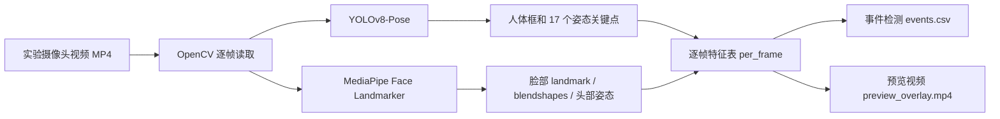

# P4 视频动作提取流程报告

## 1. 这套工具要解决什么问题

P4 项目的核心是 EEG 降噪与任务特征保真。实验视频的作用不是替代 EEG，而是给 EEG 伪迹提供一个外部参照：

- 被试什么时候眨眼。
- 被试什么时候摇头、点头。
- 被试是否出现明显嘴部动作、皱眉、眯眼等面部活动。
- Session 3/4 中任务刺激窗口内是否有违规动作。
- Session 2 中伪迹动作是否真的按要求执行。

视频分析输出的事件表可以和 EEG marker 对齐，帮助判断某段 EEG 高幅波动到底是任务脑电、眼电、肌电，还是头动伪迹。

> [!important] 核心定位
> 这套工具不是“情绪识别器”，而是“实验动作与伪迹行为提取器”。它最适合识别眨眼、头动、嘴部动作等和 EEG 伪迹直接相关的行为。

## 2. 为什么不是只用 YOLO

YOLO 很适合做目标检测和人体关键点检测，但 EEG 伪迹相关动作里有很多是面部细节：

| 动作 | 单独 YOLO-Pose 是否足够 | 当前采用方案 |
| --- | --- | --- |
| 人体位置、肩膀、头部大幅运动 | 足够 | YOLOv8-Pose |
| 摇头、点头 | 基本可用 | YOLO + Face head pose |
| 眨眼 | 不足 | MediaPipe Face Landmarker |
| 眯眼、皱眉、张口 | 不足 | MediaPipe blendshapes |
| 咬牙、吞咽 | 很难可靠识别 | 只能作为候选，需要 EEG 和人工复核 |

因此当前方案是组合式：



## 3. 当前代码结构

主要文件在：

```text
P4_EEG降噪与任务特征保真/experiment/video/analysis/
```

| 文件 | 作用 |
| --- | --- |
| `gui.py` | 图形界面，供用户选择视频、时长、输出目录并启动分析 |
| `pipeline.py` | 主流程：读视频、跑模型、写输出、事件检测 |
| `extractors.py` | YOLOv8-Pose 和 MediaPipe Face Landmarker 封装 |
| `features.py` | EAR、MAR、yaw/pitch/roll 等特征计算 |
| `events.py` | 从逐帧特征中检测 blink、head motion 等事件 |
| `run_analysis.py` | 命令行入口 |
| `_download_model.py` | 下载 MediaPipe face landmarker 模型 |
| `README.md` | 简短使用说明 |

双击启动 GUI：

```text
P4_EEG降噪与任务特征保真/experiment/video/launch_video_action_gui.bat
```

## 4. GUI 使用流程

### 4.1 打开界面

双击 `launch_video_action_gui.bat`。脚本会优先使用：

```text
D:\conda\envs\eeg-p4\python.exe
```

如果找不到该环境，会退回系统 `python`。

### 4.2 选择视频

点击“选择视频...”，选择要处理的 `.mp4` 文件，例如：

```text
scratch/video_records/camera_20260518_193936.mp4
```

界面会自动给出默认输出目录：

```text
scratch/video_records/analysis_outputs/camera_20260518_193936/
```

### 4.3 设置处理范围

有三种常用方式：

- 学习/测试：起始秒 `0`，处理时长 `5` 秒。
- 常规抽查：起始秒 `0`，处理时长 `60` 秒。
- 完整处理：勾选“处理完整视频”。

如果只是验证模型能不能跑，建议先处理 5 秒。确认预览视频正常后，再处理 60 秒或完整视频。

### 4.4 输出选项

建议默认勾选“保存叠加预览视频”。预览视频可以直接肉眼检查模型是否追踪到了人脸、人体框和关键点。

如果只想快速生成数据，可以取消预览视频，速度会稍快一点。

### 4.5 模型下载

如果界面显示 Face 模型缺失，点击“下载/修复模型”。

模型保存为：

```text
analysis/models/face_landmarker.task
```

该文件已经被 `.gitignore` 忽略，不会误提交到 git。

## 5. 输出文件怎么读

每次处理会生成一个输出目录，典型内容如下：

```text
analysis_outputs/<video_stem>/
├── per_frame.parquet
├── per_frame.csv
├── events.csv
├── meta.json
└── preview_overlay.mp4
```

### 5.1 `per_frame.parquet` / `per_frame.csv`

这是逐帧特征表。每一行对应视频中的一帧。

关键字段：

| 字段 | 含义 |
| --- | --- |
| `frame_index` | 视频帧编号 |
| `unix_time_ns` | 该帧对应的绝对时间，来自录制时的 timestamp CSV |
| `elapsed_seconds` | 从视频开始到该帧的时间 |
| `yolo_detected` | YOLO 是否检测到人体 |
| `face_detected` | MediaPipe 是否检测到人脸 |
| `ear_left/right/mean` | Eye Aspect Ratio，眼睛开合程度 |
| `mar` | Mouth Aspect Ratio，嘴巴开合程度 |
| `yaw_deg` | 左右转头角度 |
| `pitch_deg` | 上下点头角度 |
| `roll_deg` | 头部左右倾斜角度 |
| `bs_eyeBlinkLeft/Right` | MediaPipe 眨眼 blendshape 分数 |
| `kpt_*` | YOLO 17 个人体关键点 |

> [!tip] 学习重点
> `per_frame` 是最底层、最完整的数据。以后如果觉得事件检测阈值不合适，可以不用重新跑 YOLO/MediaPipe，只基于这个表重新调阈值。

### 5.2 `events.csv`

这是从逐帧表中自动提取出的动作事件。

关键字段：

| 字段 | 含义 |
| --- | --- |
| `event_type` | 事件类型，如 `blink`、`head_yaw_motion` |
| `onset_frame` | 事件开始帧 |
| `offset_frame` | 事件结束帧 |
| `duration_frames` | 持续帧数 |
| `onset_unix_ns` | 事件开始绝对时间 |
| `offset_unix_ns` | 事件结束绝对时间 |
| `duration_seconds` | 事件持续时间 |
| `metric_name` | 触发事件的指标名 |
| `metric_value` | 指标峰值或谷值 |

示例解释：

```text
event_type = blink
onset_frame = 174
offset_frame = 184
duration_frames = 11
duration_seconds = 0.333
metric_name = blink_score
metric_value = 0.683
```

这表示第 174 到 184 帧之间检测到一次眨眼，持续约 0.33 秒，眨眼分数峰值约 0.683。

### 5.3 `preview_overlay.mp4`

这是带可视化叠加的视频：

- 绿色框：YOLO 检测到的人体框。
- 紫色点：YOLO 姿态关键点。
- 黄色点：脸部关键点中的眼、嘴、鼻、下巴等核心点。
- 左上角文字：EAR、yaw、pitch 等当前帧指标。

这个文件最适合用来人工检查模型是否跑偏。

### 5.4 `meta.json`

记录本次处理参数和摘要，例如：

- 输入视频路径。
- 处理起始帧和结束帧。
- 总处理帧数。
- Face 检出率。
- YOLO 检出率。
- 事件数量和分类统计。
- 输出文件路径。

## 6. 关键算法解释

### 6.1 YOLOv8-Pose

YOLOv8-Pose 输出人体检测框和 17 个 COCO 姿态关键点：

- 鼻子
- 左右眼
- 左右耳
- 左右肩
- 左右肘
- 左右腕
- 左右髋
- 左右膝
- 左右踝

在本项目中，YOLO 主要用于：

- 判断画面中是否有人。
- 估计上半身姿态。
- 辅助识别大幅头动或身体动作。

### 6.2 MediaPipe Face Landmarker

MediaPipe Face Landmarker 输出：

- 脸部 landmarks。
- 面部 blendshapes。

landmarks 用于计算几何指标，blendshapes 直接给出面部动作分数。

当前重点使用的 blendshapes：

| blendshape | 含义 |
| --- | --- |
| `eyeBlinkLeft/Right` | 左右眼眨眼程度 |
| `eyeSquintLeft/Right` | 眯眼程度 |
| `jawOpen` | 张口程度 |
| `mouthClose` | 闭嘴程度 |
| `mouthPucker` | 撅嘴 |
| `browDownLeft/Right` | 皱眉 |
| `browInnerUp` | 抬眉 |

### 6.3 EAR：眼睛开合程度

EAR 全称 Eye Aspect Ratio，用眼睛上下关键点距离除以左右眼角距离。

直观理解：

- 眼睛睁开时，EAR 较大。
- 眨眼闭合时，EAR 迅速降低。

公式可以理解为：

$$
EAR = \frac{眼睛上下距离_1 + 眼睛上下距离_2}{2 \times 眼睛左右宽度}
$$

当前眨眼检测优先使用 `eyeBlinkLeft/Right` blendshape，EAR 作为辅助理解和后续调试指标。

### 6.4 MAR：嘴巴开合程度

MAR 全称 Mouth Aspect Ratio，用嘴巴上下距离除以嘴角左右距离。

直观理解：

- 嘴巴闭合时，MAR 较小。
- 张口、说话、明显口部运动时，MAR 增大。

它可以帮助发现张口、吞咽前后嘴部动作、明显面部肌肉活动，但不能可靠地区分“咬牙”和“吞咽”。

### 6.5 头部姿态：yaw / pitch / roll

当前用 Face landmarks 和 OpenCV `solvePnP` 估计头部姿态：

| 指标 | 含义 | 对应动作 |
| --- | --- | --- |
| `yaw_deg` | 左右转头 | 摇头 |
| `pitch_deg` | 上下抬头/低头 | 点头 |
| `roll_deg` | 头向左/右倾斜 | 歪头 |

事件检测不是直接看角度，而是看角度变化速度：

- yaw 变化速度过大 → `head_yaw_motion`
- pitch 变化速度过大 → `head_pitch_motion`

## 7. 当前事件检测规则

当前 `events.py` 中是规则检测，不是深度学习分类器。

默认逻辑：

| 事件 | 当前检测依据 |
| --- | --- |
| `blink` | `eyeBlinkLeft/Right` 平均分数超过阈值 |
| `head_yaw_motion` | yaw 角速度超过阈值 |
| `head_pitch_motion` | pitch 角速度超过阈值 |
| `mouth_open` | MAR 超过阈值 |

优点：

- 可解释。
- 阈值容易调。
- 适合 EEG 伪迹分析，因为每个事件都有明确指标来源。

缺点：

- 不能保证每个事件都是真实动作。
- 对光照、摄像头角度、被试脸部遮挡敏感。
- 咬牙、吞咽这类细微动作很难靠普通摄像头可靠识别。

## 8. 如何和 EEG marker 对齐

视频录制时已经生成 timestamp CSV，例如：

```text
camera_20260518_193936_timestamps.csv
```

每一帧都有：

- `video_frame_index`
- `unix_time_ns`
- `unix_time_seconds`
- `elapsed_seconds`

处理后这些时间字段会进入 `per_frame` 和 `events.csv`。

因此后续和 EEG 对齐的关键是：

```text
video event onset_unix_ns  <->  EEG marker unix time
```

如果 EEG marker 也能导出绝对时间，就可以直接比较。如果 EEG 只有采样点编号，则需要知道 EEG 采集起始绝对时间和采样率：

$$
t_{marker} = t_{eeg\_start} + \frac{sample\_index}{sampling\_rate}
$$

然后将视频事件和 EEG marker 放到同一个时间轴上。

## 9. 已验证结果

已经用第二段视频 `camera_20260518_193936.mp4` 做过前 60 秒验证：

| 指标 | 结果 |
| --- | --- |
| 处理帧数 | 1800 帧 |
| Face 检出率 | 1.0 |
| YOLO 检出率 | 1.0 |
| 检测事件总数 | 24 |
| blink | 20 |
| head_yaw_motion | 3 |
| head_pitch_motion | 1 |
| CPU 速度 | 约 24 fps |

这说明当前管线在这段视频上可以稳定跑通。

> [!note]
> 24 fps 表示处理速度接近实时。10 分钟视频大约需要十几分钟；30 分钟视频可能需要半小时以上，具体取决于 CPU 状态和是否保存预览视频。

## 10. 当前局限性

### 10.1 不是医学级真值

视频事件只能作为辅助标签。真正的伪迹确认仍然要看 EEG 波形、marker 和实验日志。

### 10.2 细微动作识别有限

普通摄像头很难稳定识别：

- 咬牙
- 吞咽
- 轻微面部紧张
- 眼球小幅水平移动

这些动作在 EEG 中可能很明显，但在视频外观上不一定明显。

### 10.3 阈值需要按被试和摄像头调

不同被试眼裂大小、坐姿、光照、摄像头角度不同，眨眼和头动阈值可能需要校准。

### 10.4 表情识别不是当前主目标

当前已经保存部分表情相关 blendshape，可以识别皱眉、眯眼、张嘴等面部动作。但“开心、生气、悲伤”等情绪分类不适合作为本项目的默认输出。

## 11. 建议学习路线

如果你想真正理解这套流程，建议按下面顺序看：

1. 先用 GUI 处理 5 秒视频，打开 `preview_overlay.mp4` 看模型画了什么。
2. 打开 `events.csv`，理解每个事件的 onset/offset。
3. 打开 `per_frame.csv`，观察 `bs_eyeBlinkLeft`、`bs_eyeBlinkRight` 在眨眼时如何升高。
4. 看 `events.py`，理解阈值规则如何把逐帧曲线变成事件。
5. 看 `pipeline.py`，理解视频如何逐帧进入 YOLO 和 MediaPipe。
6. 最后再考虑 EEG marker 对齐。

## 12. 下一步可以做什么

推荐后续改进：

- 增加 GUI 中的“事件阈值调节”面板。
- 增加事件时间轴可视化图，例如 blink/yaw/pitch 随时间变化。
- 增加 EEG marker 导入功能，自动计算视频事件和 EEG marker 的时间差。
- 对 Session 2 的 8 类伪迹动作建立专门规则。
- 对 Session 3/4 增加“刺激窗口内违规眨眼/头动”报告。

## 13. 一句话总结

这套工具的本质是：

> 把实验视频变成一张可和 EEG marker 对齐的行为事件表，用来辅助判断 EEG 伪迹发生的时间、类型和强度。

